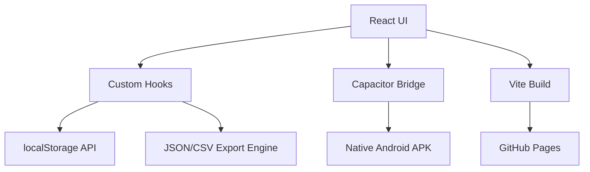

<div align="center">
  
</div>

<h1 align="center">React + Capacitor Todo App (Web & Android)</h1>

<div align="center">
  <p><strong>A beautiful, feature-rich task manager that runs natively on Android and the Web. Built with React, TypeScript, and Capacitor.</strong></p>
  
  <p>
    <a href="https://tapiwamakandigona.github.io/todo-app/"></a>
    <a href="https://github.com/tapiwamakandigona/todo-app/releases"></a>
    
  </p>
</div>

---

## ⚡ Why This App?

Most "todo app" tutorials show a basic list with checkboxes. This project demonstrates **production-grade cross-platform architecture**: a single React codebase compiled to both a Progressive Web App (PWA) and a native Android APK via **Capacitor 5**, with offline-first local storage, CSV/JSON export, drag-and-drop priority sorting, and category management.

<br/>

## 🎯 Features

| Feature | Implementation |
|---------|---------------|
| **Cross-Platform** | Single codebase → Web (Vite) + Android (Capacitor 5) |
| **Offline-First** | `localStorage` persistence — works without internet |
| **Export/Import** | JSON & CSV backup/restore of all tasks |
| **Priority System** | Low/Medium/High with color-coded visual indicators |
| **Category Tags** | Organize tasks into custom categories |
| **Dark Mode** | System-aware theme switching |
| **CI/CD Pipeline** | Auto-deploy to GitHub Pages + APK builds on tags |

---

## 🛠️ Technology Stack

- **Frontend:** React 19, TypeScript
- **Mobile:** Capacitor 5 (Android native bridge)
- **Build:** Vite
- **CI/CD:** GitHub Actions (Web deploy + APK build)
- **Hosting:** GitHub Pages (Web), GitHub Releases (APK)

---

## 🏗️ Architecture



---

## 🚀 Quick Start

```bash
git clone https://github.com/tapiwamakandigona/todo-app.git
cd todo-app
npm install
npm run dev
```

### Build Android APK Locally
```bash
npm run build
npx cap sync
cd android && ./gradlew assembleDebug
```

---

<div align="center">
  <b>Built by <a href="https://github.com/tapiwamakandigona">Tapiwa Makandigona</a></b>
  <br/>
  <i>⭐ Star this repo if you found the cross-platform architecture useful!</i>
</div>
